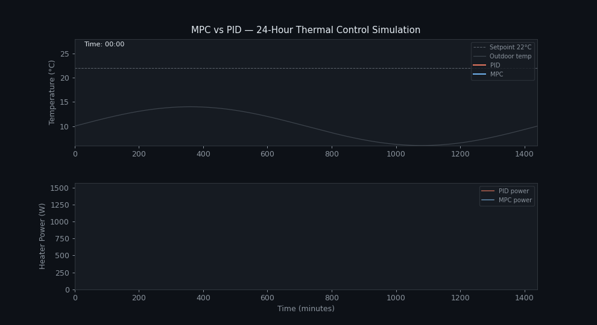

# Thermal Home Control: MPC vs. PID

A Python simulation comparing **Model Predictive Control (MPC)** and **PID control** for maintaining indoor temperature in a residential room across a 24-hour cycle. Both controllers are auto-tuned using **Differential Evolution**. The study is framed through Ashby's cybernetic concepts of **ultrastability** and **homeostasis**.



---

## Abstract

> *This study presents a comparison between PID control and MPC for a residential heating system with sensor delay, time-varying heat loss, and heater output variability. Controllers were implemented and optimised using Differential Evolution. MPC outperformed PID in both temperature stability and energy efficiency. These findings are interpreted through Ashby's concepts of ultrastability and biological homeostasis — viewing MPC as a cybernetic controller capable of sustaining internal equilibrium in dynamic environments.*

---

## Thermal model

The room temperature obeys a first-order ODE:

$$\frac{dT}{dt} = \frac{1}{C}\left[Q_{\text{heater}}(t) - k(t)\,(T - T_{\text{out}}(t))\right]$$

| Symbol | Description | Value |
|---|---|---|
| $C$ | Thermal capacitance | 2000 J/°C |
| $k(t)$ | Time-varying heat-loss coefficient | $4.0 + 0.1\sin\!\left(\frac{2\pi t}{720}\right)$ W/°C |
| $T_{\text{out}}(t)$ | Outdoor temperature (day-night swing) | $10 + 4\sin\!\left(\frac{2\pi t}{1440}\right)$ °C (range 6–14°C) |
| $Q_{\max}$ | Heater max power | 1500 W |
| $T_{\text{setpoint}}$ | Target indoor temperature | 22°C |

### Realism additions

- **Sensor delay:** 5-step measurement buffer representing measurement latency
- **Sensor noise:** Gaussian noise σ = 0.1°C on every reading
- **Heater inertia:** First-order lag with time constant τ = 5 min
- **Heater noise:** Gaussian noise σ = 10 W on heater output

---

## Controllers

### PID

Standard discrete-time PID with output clipping:

$$u(t) = K_p\,e(t) + K_i\!\int e\,dt + K_d\,\dot{e}(t), \quad u \in [0, Q_{\max}]$$

A smoothing term weighted by Γ = 0.6 penalises rapid changes in heater power between steps, preventing hardware stress and unnecessary energy spikes.

### MPC (Receding Horizon)

At each step, solves a 60-step lookahead optimisation:

$$\min_{u_0,\ldots,u_{H-1}} \;\alpha \sum_{i=0}^{H-1} p(T_i, T_{\text{sp}}) + \beta \sum_{i=0}^{H-1}\!\left[u_i^2 + \Gamma(u_i - u_{i-1})^2\right]$$

$$p(T_i, T_{\text{sp}}) = \begin{cases} 2(T_i - T_{\text{sp}})^2 & \text{if } T_i > T_{\text{sp}} \\ (T_i - T_{\text{sp}})^2 & \text{otherwise} \end{cases}$$

Overshoot is penalised 2× to discourage wasting energy by overheating. Only $u_0$ is applied; the horizon then shifts by one step (receding-horizon principle). The embedded optimisation uses `scipy.optimize.minimize` with L-BFGS-B bounds.

---

## Parameter optimisation

Both controllers were tuned with **Differential Evolution** — a gradient-free global optimiser suitable for the noisy, stochastic simulation objective.

| Parameter | Search bounds | Optimised value |
|---|---|---|
| PID $K_p$ | [85, 100] | **86.05** |
| PID $K_i$ | [0.15, 0.30] | **0.16** |
| PID $K_d$ | [3, 5] | **4.2** |
| MPC $\alpha$ (tracking weight) | [1000, 1200] | **1100.0** |
| MPC $\beta$ (energy weight) | [0.100, 0.105] | **0.103** |

---

## Results

### Temperature tracking (RMSE from 22°C setpoint)

| Window | PID | MPC | Improvement |
|---|---|---|---|
| Full 24 h | 1.03°C | 0.97°C | **5.8% lower** |
| After 60-min warm-up | 0.12°C | 0.09°C | **25% lower** |

### Energy consumption

| Window | PID | MPC | MPC saving |
|---|---|---|---|
| Full 24 h | 91,614 W·min (38.17 kWh) | 91,132 W·min (37.97 kWh) | **0.52%** |
| After 30-min warm-up | 70,941 W·min | 68,945 W·min | **2.81%** |

MPC's advantage grows under larger disturbances or wider prediction horizons. The gap here is modest because PID gains were globally optimised via DE rather than hand-tuned — prior literature reports 15–34% savings in real buildings where PID is conventionally tuned (Sirokỳ et al., 2011; Joe & Karava, 2019).

---

## Cybernetic interpretation

The study frames the two controllers through **Ashby's design for a brain** (1960):

- **PID** is a fixed negative feedback loop — stable within a range, but not *ultrastable*. It cannot change its own parameters when the environment changes beyond its tuned range.
- **MPC** exhibits a higher form of stability: it constantly recalculates its strategy using a predictive model, analogous to **biological homeostasis** — the way animals use feed-forward physiological adjustments (e.g. releasing adrenaline before exertion) to maintain internal stability.

---

## Notebook structure

| Section | Content |
|---|---|
| 1. Setup & Model | Imports, physical parameters, environment functions |
| 2. Controller Definitions | PID and MPC classes with docstrings, simulation loop |
| 3. Parameter Optimisation | Differential Evolution for both controllers |
| 4. Simulation Results | 24-hour temperature and energy plots |
| 5. Performance Analysis | Steady-state error and energy comparison |
| 6. Summary | Consolidated metrics table and key findings |

---

## Getting started

```bash
pip install numpy scipy matplotlib jupyter
jupyter notebook thermal_mpc_pid.ipynb
```

The optimisation cell (Section 3) can be skipped — pre-optimised values are loaded in Section 4 so you can see results immediately.

---

## Tech stack

- **NumPy** — numerical simulation and array ops
- **SciPy** (`differential_evolution`, `minimize`) — global and local optimisation
- **Matplotlib** — visualisation and animated GIF export
- **Jupyter** — interactive notebook

---

## Future directions

- Hybrid MPC-PID strategies
- Adaptive MPC with online model parameter updates
- Reinforcement Learning for model-free adaptive control (Wang et al., 2023 showed RL can match MPC with sufficient training data)
- Multi-zone building models with more complex thermal dynamics
